# 东方红魔乡 ～ the Embodiment of Scarlet Devil.[plus]

<p align="center">
<a href="README.md">English</a> | 简体中文
</p>

<p align="center">
  <picture>
    <source media="(prefers-color-scheme: dark)" srcset="resources/progress_dark.svg">
    
  </picture>
</p>


[![Discord][discord-badge]][discord] <- 点击此处加入 Discord 服务器。

[discord]: https://discord.gg/VyGwAjrh9a
[discord-badge]: https://img.shields.io/discord/1147558514840064030?color=%237289DA&logo=discord&logoColor=%23FFFFFF

本项目基于 GensokyoClub 的 [th06](https://github.com/GensokyoClub/th06) 进行了修改。


## 修改内容

本分支包含以下修改：

- **修复帧率错误** - 修复了游戏以错误速度运行的 bug
- **内置命中判定指示器** - 按下 Shift 键时显示以玩家为中心的顺时针旋转命中判定指示器
- **无限自机** - Miss 时自动获得一个自机
- **汉化支持** - 完整的中文文本支持，使用 GB2312 字符集和 SimHei 字体
- **默认窗口模式** - 游戏默认以窗口模式启动

### 汉化数据

汉化版 DAT 文件（`th06c_*.DAT`）来源于 [thdog.moe](https://cn.thdog.moe/%E5%9B%BD%E9%99%85%E5%88%86%E6%B5%811/%E4%B8%9C%E6%96%B9Project/%E5%AE%98%E6%96%B9%E6%B8%B8%E6%88%8F/%E6%95%B4%E6%95%B0%E4%BD%9C/%5Bth06%5D%20%E4%B8%9C%E6%96%B9%E7%BA%A2%E9%AD%94%E4%B9%A1%20(%E6%B1%89%E5%8C%96%E7%89%88+%E6%97%A5%E6%96%87%E7%89%88)%201.02h.zip)。

---

原始项目描述：

本项目旨在完美还原上海爱丽丝幻乐团的《东方红魔乡 ～ the Embodiment of Scarlet Devil 1.02h》的源代码。

## 安装

### 可执行文件

本项目需要原始的 `東方紅魔郷.exe` 1.02h 版本（SHA256 哈希值：9f76483c46256804792399296619c1274363c31cd8f1775fafb55106fb852245，在 Windows 上可以使用命令 `certutil -hashfile <你的文件路径> SHA256` 校验哈希值）。

将 `東方紅魔郷.exe` 复制到 `resources/game.exe`。

### 依赖项

构建系统需要以下包：

- `python3` >= 3.4
- `msiextract`（仅在 Linux/macOS 上需要）
- `wine`（仅在 Linux/macOS 上需要，macOS 上推荐使用 CrossOver 以避免 CL.EXE 的堆问题）
- `aria2c`（可选，支持 BT 下载，若在 Windows 上选择此方式将自动安装）

其余构建工具（Visual Studio 2002 和 DirectX 8.0）将从 Web Archive 自动获取。

#### 配置开发环境

这将下载并安装编译器、库和其他工具。

如果你使用 Windows，并出于某种原因希望手动下载依赖项，请运行以下命令获取需要下载的文件列表：

```
python scripts/create_devenv.py scripts/dls scripts/prefix --no-download
```

但如果你希望自动下载所有内容，请改为运行：

```
python scripts/create_devenv.py scripts/dls scripts/prefix
```

如果你想使用 BT 下载这些依赖项，请使用：

```
python scripts/create_devenv.py scripts/dls scripts/prefix --torrent
```

在 Linux 和 Mac 上，运行以下脚本：
```bash
# 注意：在 macOS 上如果使用 CrossOver，请设置：
# export WINE=<CrossOver路径>/wine
./scripts/create_th06_prefix
```

#### 构建

运行以下脚本：

```
python3 ./scripts/build.py
```

这将自动生成 ninja 构建脚本 `build.ninja`，并运行 ninja。

#### 创建发布包

要创建可分发的发布包：

```
python3 ./scripts/release.py
```

此命令将：
1. 清理构建目录中的不必要文件（目标文件、调试符号等）
2. 创建一个仅包含必要游戏文件的 zip 压缩包

选项：
- `--no-clean` - 跳过清理构建目录
- `--no-zip` - 跳过创建 zip 压缩包
- `-o PATH` - 指定 zip 文件的输出路径
- `-n NAME` - 指定发布名称（默认：th06e-release）

## 参与贡献

### 逆向工程

你可以在配套仓库 [th06-re] 的 `xml` 分支中找到我们 Ghidra 逆向工程的 XML 导出文件。该仓库通过 [`scripts/export_ghidra_database.py`] 每日更新，其历史记录与我们团队的 Ghidra 服务器提交历史一致。

如果你想参与逆向工程工作，请通过 Discord 联系 @roblabla，以便我们为你提供 Ghidra 服务器的账号。

### 重新实现

使用 [`objdiff`](https://github.com/encounter/objdiff) 是进行重新实现工作的最简单方式。以下是入门步骤：

1. 首先，按照上述说明配置好开发环境。
2. 将原始的 `東方紅魔郷.exe` 文件（1.02h 版本）复制到 `resources/` 文件夹，并重命名为 `game.exe`。该文件将作为比较重新实现结果的源文件。
3. 下载最新版本的 objdiff。
4. 运行 `python3 scripts/export_ghidra_objs.py --import-csv`。这将从 `resources/game.exe` 中提取 objdiff 可以用来对比的目标文件。
5. 最后，运行 objdiff 并打开 th06 项目。

#### 选择要反编译的函数

最简单的方法是查看 `config/stubbed.csv` 文件。这些文件中的函数都是已自动存根的函数。你可以选择其中一个，在 objdiff 中打开关联的目标文件，然后点击你感兴趣的函数。

接着，打开对应的 `cpp` 文件，复制粘贴函数声明，然后开始编写代码！参考 Ghidra 反编译器的输出可能会有所帮助。你可以在 [th06-re] 仓库中找到这些输出。

# 致谢

我们谨向以下个人表示衷心的感谢，感谢他们的宝贵贡献：

- @EstexNT 将 [`var_order` pragma](scripts/pragma_var_order.cpp) 移植到了 MSVC7。

[th06-re]: https://github.com/happyhavoc/th06-re